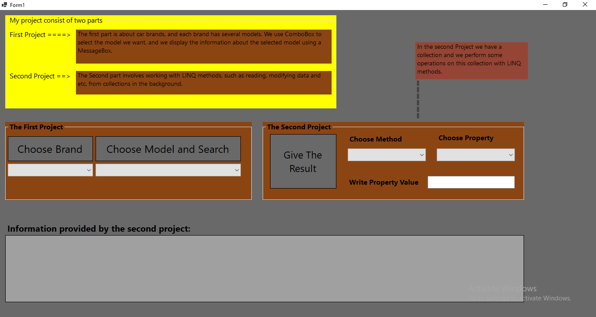

# Car Finder 

**Car Finder** — is a simple but functional application developed using C# Windows Forms.
The main purpose of the project is to **manage brand and model data** and perform operations such as filtering, searching, sorting with **LINQ queries**.

## ✨ Features
- Manage brand and model lists
- Automatically populate model list based on brand selection
- Using LINQ:
-  Filtering
-  Sorting
-  Search operations
- Simple and user-friendly interface

## 🛠 Technologies used
- **C#** (.NET Framework)
- **Windows Forms**
- **LINQ**

## 📂 Project structure
- **Classes/Car.cs** — Brand data model
- **Classes/Model.cs** — Model data model
- **Form1.cs** — Main form and UI logic
- **Form1.Designer.cs** — Form design codes

## 🚀 Usage
1. Open the project in Visual Studio.
2. Run the application by clicking the `Run` button.
3. Select a brand and see the models related to it.
4. Try out LINQ operations.

## 📷 Screenshot

---

💡 This project is a good example to learn LINQ and manipulate data structures in Windows Forms.
